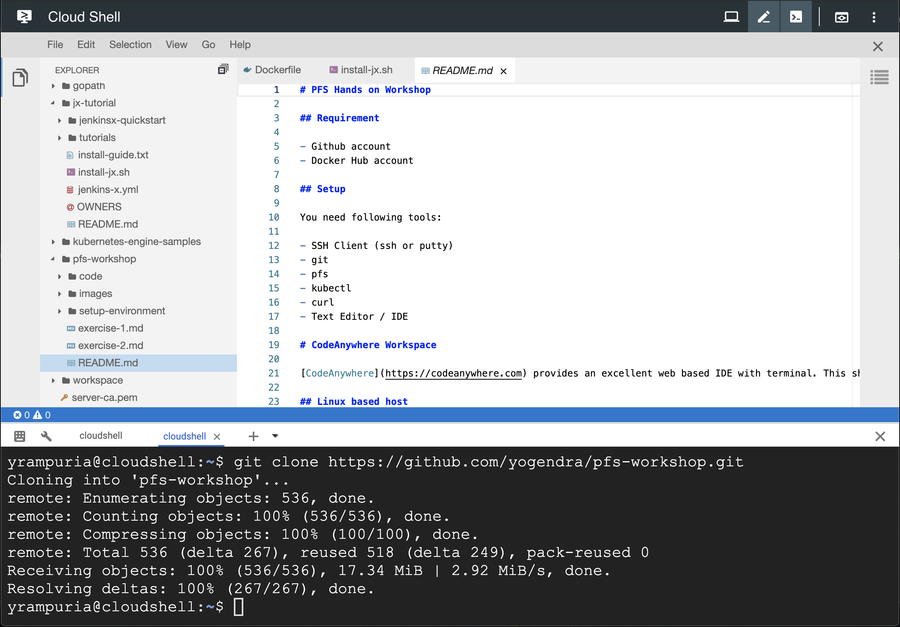
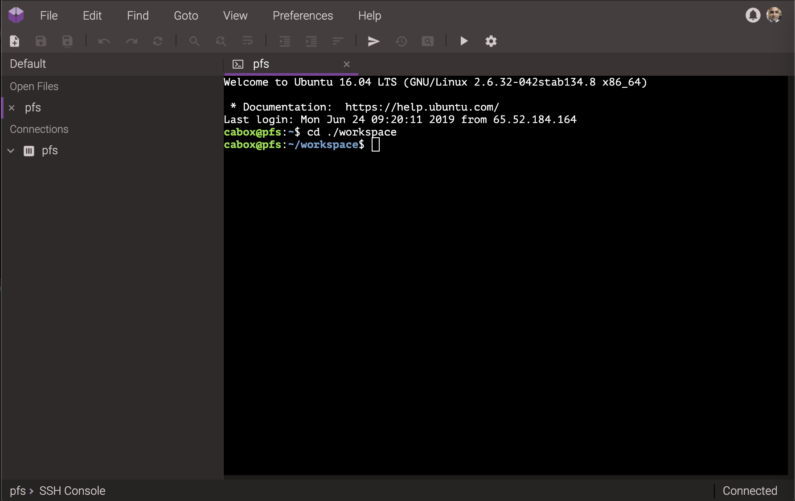

# PFS Hands on Workshop

## Requirement

- Github account
- Docker Hub account

## Setup

You need following tools:

- Linux or Mac environment (required)
- SSH Client (ssh or putty)
- git
- kubectl
- pfs
- curl
- Text Editor / IDE

## Cloud Workspace: Google Cloud Shell

Google Cloud provides a very good browser based shell. It is free to use. You will need a Google account to access cloudshell.
Just go to [Google Cloud Console - Cloudshell](https://console.cloud.google.com/cloudshell/editor) and follow the instructions to start cloud shell.



Ones you are in the shell, follow instruction in the [Linux based host](#linux-based-host) section of this page to finish setup.

## Cloud Workspace: CodeAnywhere

[CodeAnywhere](https://codeanywhere.com) provides an excellent web based IDE with terminal. This should sufficient for our usage. Just go through the signup process. You will need to verify you email in order to start using the workspace.

1. Signup using you email, github or any other social account
1. Verify you email
1. Create a workspace and call it pfs
1. Run the setup commands in the [Linux based host](#linux-based-host) section to finish setting



## Linux based host

- Setup kubectl (skip for GCP cloudshell)

  ```
  curl -sLO https://storage.googleapis.com/kubernetes-release/release/$(curl -s https://storage.googleapis.com/kubernetes-release/release/stable.txt)/bin/linux/amd64/kubectl
  chmod a+x kubectl
  sudo mv kubectl /usr/local/bin
  kubectl completion bash | sudo tee /etc/bash_completion.d/kubectl > /dev/null
  ```

- Setup pfs

  ```
  curl -sLO https://github.com/yogendra/pfs-workshop/raw/master/setup-environment/online-workspace/pfs.linux
  chmod a+x pfs.linux
  sudo mv pfs.linux /usr/local/bin/pfs
  pfs completion bash | sudo tee /etc/bash_completion.d/pfs > /dev/null

  ```

- Fetch Kuberentes config for workshop.

  ```
  # Change this to you own user id given by the instructor
  export WS_USER=CHANGE_ME
  ```

  _Following lines can be copy pasted_

  ```
  mkdir -p $HOME/.kube
  [[ -e $HOME/.kube/config ]] && cp $HOME/.kube/config $HOME/.kube/config.original
  curl -sL https://github.com/yogendra/pfs-workshop/raw/master/setup-environment/users/$WS_USER/config -o \$HOME/.kube/config

  ```

## Test Workspace Setup

To check that you environment is configured properly, you may run following commands.

```
kubectl cluster-info
```

```
pfs service list
```

## Exercises

[Simple Function](exercise-1.md)

[Java and JS Based Functions](exercise-2.md)

[Channels and Subscription](exercise-3.md)
